# [Apache Kafka Tutorial with Spring Boot Reactive & WebFlux | Kafka Tutorial](https://www.youtube.com/watch?v=KQDTtvZMS9c)

Tutorial tomado del canal de **Bouali Ali**

---

## ¿Qué es un Message Broker?

Un `message broker` **(intermediario de mensajes o broker de mensajes)** es un componente de software intermediario
responsable de facilitar la comunicación y el intercambio de datos entre diferentes aplicaciones o sistemas, por lo que
su función principal es desacoplar a los `Producers`, que son las aplicaciones que envían datos al `broker`
(intermediario), de los `Consumers`, que son las aplicaciones que reciben los datos; por lo que el intermediario de
mensajes actúa como mediador asegurando que los mensajes se entreguen de manera eficiente y confiable desde
el `Producer` al `Consumer`.

La característica clave de los intermediarios de mensajes son, primero, tenemos el desacoplamiento por lo tanto, el
intermediario de mensajes permite un acoplamiento flexible entre las aplicaciones al permitirles comunicarse sin la
necesidad de estar al tanto de la existencia de cada uno.

Como Message Broker tenemos a: `Apache Kafka, Amazon SQS o RabbitMQ`.

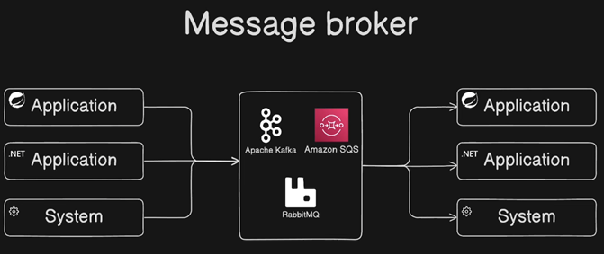

## Apache Kafka Global Overview

`Apache Kafka` es una plataforma de procesamiento de flujo e intermediario de mensajes distribuido, tolerante a fallas y
altamente escalable. `Apache Kafka` está diseñado para manejar grandes volúmenes de flujos de datos en tiempo real y de
manera tolerante a fallas.

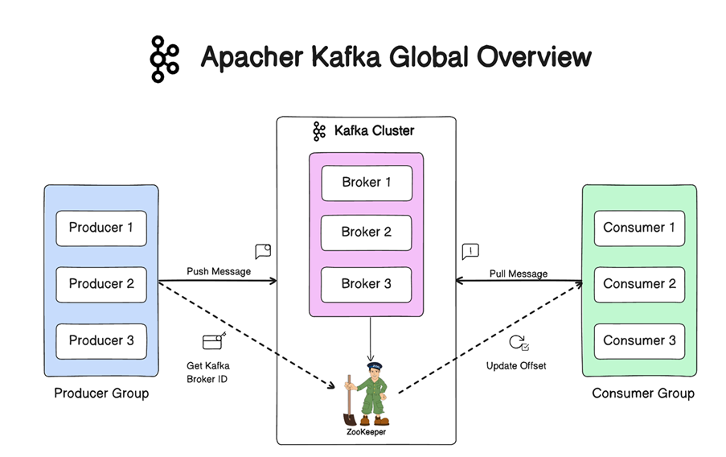

## Kafka Cluster

Kafka es diseñado para operar como un sistema distribuido y un cluster le permite escalar horizontalmente, proporciona
tolerancia y maneja grandes volúmenes de datos a través de múltiples nodos.

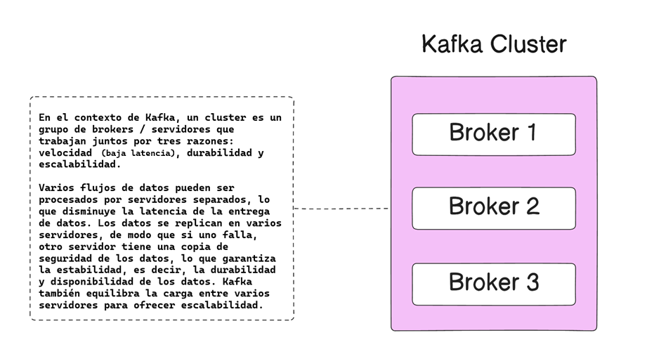

## Kafka Broker

Los brokers de Kafka son servidores con tareas especiales: gestionar el equilibrio de carga, la replicación y el
desacoplamiento de flujos dentro del clúster de Kafka. Cómo hacen su trabajo? Bueno, en primer lugar, para iniciar un
clúster kafka, el desarrollador se autentica en un servidor boostrap (o unos cuantos). Estos son los primeros servidores
del clúster. Luego, los brokers también equilibran la carga y se encargan de la replicación, y esas dos características
son clave para la velocidad, escalabilidad y estabilidad de kafka.

Por lo que, un `Kafka Broker` es un `servidor Kafka individual` que almacena datos y atiende las solicitudes de los
clientes. Los `Brokers` dentro de un cluster se comunican entre sí para garantizar la replicación de datos y mantener
los metadatos del clúster y a cada broker en un clúster de kafka se le asigna un identificador único.

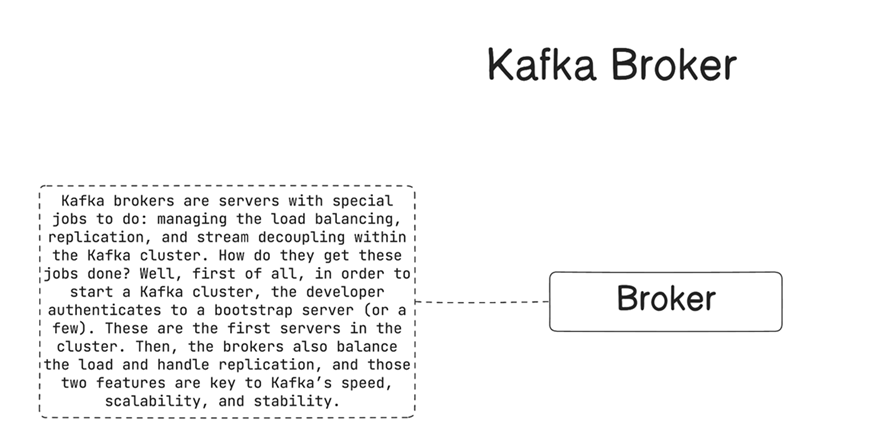

## Kafka Producer

El `Producer` es una aplicación cliente que publica o escribe eventos en un clúster de Kafka, por lo que el producer
puede ser una aplicación java, php, .net o cualquier otro tipo de aplicación, incluso una línea de comandos y
simplemente escribe o envía un evento a un clúster de Kafka.

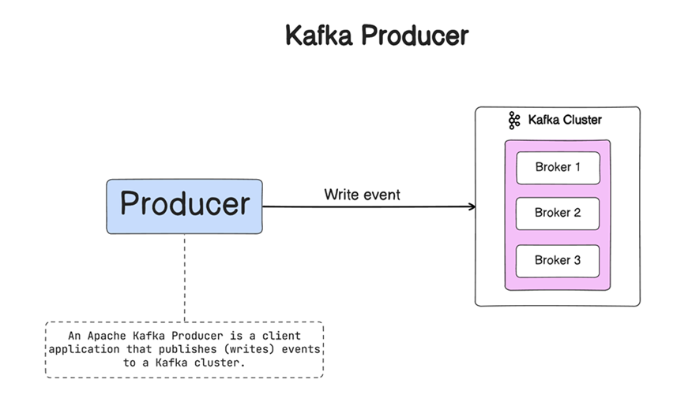

## Kafka Consumer

El `consumer` es la aplicación o el sistema que consume o se suscribe al `topic` o al clúster de kafka para consumir los
eventos. Pueden ser parte de un grupo de consumidores que les permite paralelizar el procesamiento de mensajes.

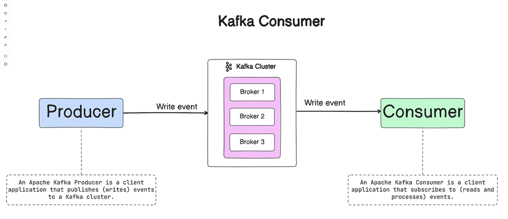

## Kafka Topic

Un `kafka topic` es un canal lógico o una categoría de alimentación en la que los productores publican registros
(mensajes) y los consumidores consumen registros. Los `topics` sirven para organizar y categorizar el flujo de mensajes
dentro del sistema de mensajería kafka.

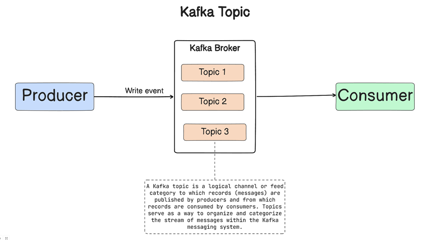

## Kafka Partitions

En Apache Kafka, una partición es una unidad básica de paralelismo y escalabilidad. Es una forma de dividir
horizontalmente un topic en múltiples unidades gestionadas independientemente. Cada partición es una secuencia de
registros estrictamente ordenada e inmutable, y desempeña un papel crucial en la distribución, el procesamiento paralelo
y la tolerancia a fallos de los datos dentro de un clúster de kafka.

Las `partitions` permiten el escalado horizontal y el procesamiento paralelo de datos dentro de un tema. Cada partición
puede considerarse como un flujo independiente de mensajes para que los productores puedan escribir y los consumidores
puedan leer desde diferentes particiones simultáneamente, lo que le permite a Kafka manejar un mayor volumen de datos
al distribuir la carga de trabajo entre múltiples particiones.

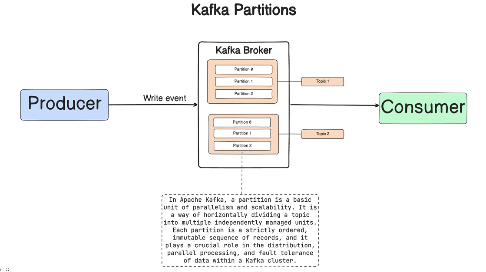

## Offsets

Offsets es una secuencia de identificadores que se asignan a los mensajes a medida que llegan a una partición. Una vez
asignado el offset, nunca se cambiará. El primer mensaje recibe un offset cero (0). El siguiente mensaje recibe un
offset uno (1), y así sucesivamente.

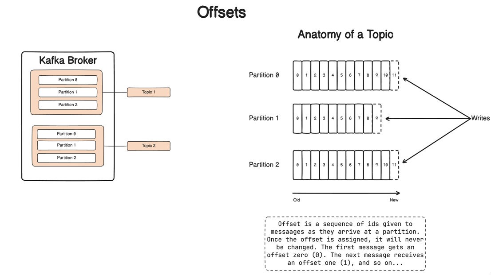

## Consumer Groups

Un grupo de consumidores es una agrupación lógica de consumidores de Kafka que trabajan juntos para consumir y procesar
mensajes de una o más particiones de un topic. Para que cada partición de un topic pueda asignarse como máximo a un
consumidor dentro de un grupo de consumidores. Como puede ver, esto garantiza que cada mensaje dentro de una partición
sea procesada solo por un consumer a la vez.

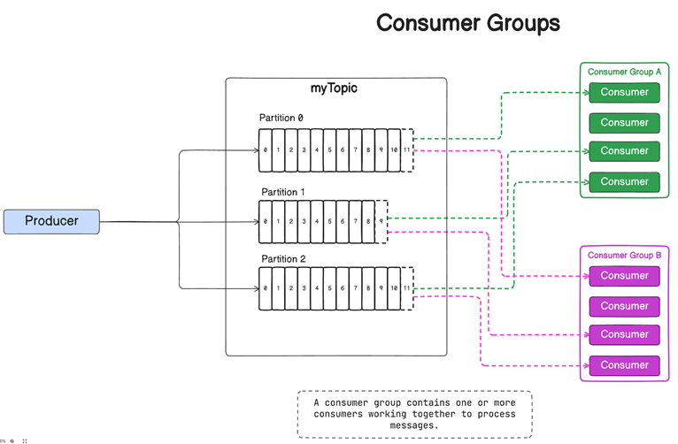

---

# [Kafka Installation](https://kafka.apache.org/quickstart)

---

Vamos a la siguiente dirección [kafka.apache.org/quickstart](https://kafka.apache.org/quickstart) y seguimos la
secuencia de la imagen:

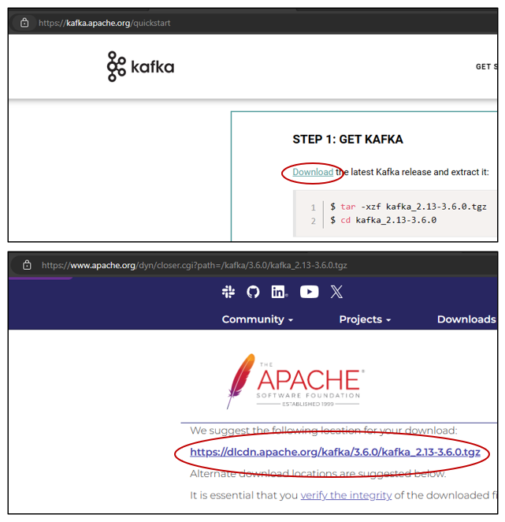

Luego de descargar el archivo `kafka_2.13-3.6.0.tgz` **lo descomprimiremos en la raíz del disco** `C:\\`.
En mi caso quedaría de la siguiente manera `C:\kafka_2.13-3.6.0`.

## Configurando Kafka para windows

Realizamos la siguiente configuración **de manera manual** para que **Kafka funcione en Windows**, ya que por defecto
está configurado para que funcione con servidores Linux/Mac.

Abrimos el archivo `server.properties` ubicado en `C:\kafka_2.13-3.6.0\config` y cambiamos el directorio linux por
nuestro directorio de windows donde está nuestro servidor de kafka:

````properties
# A comma separated list of directories under which to store log files
#log.dirs=/tmp/kafka-logs (por defecto)
log.dirs=C:/kafka_2.13-3.6.0/kafka-logs
````

También debemos modificar el archivo `zookeeper.properties` ubicado en `C:\kafka_2.13-3.6.0\config`:

````properties
# the directory where the snapshot is stored.
# dataDir=/tmp/zookeeper (por defecto)
dataDir=C:/kafka_2.13-3.6.0/zookeeper
````

## Iniciando servidor Zookeeper y Kafka

Nos ubicamos mediante la terminal en nuestro directorio de instalación de kafka `C:/kafka_2.13-3.6.0` y procedemos a
ejecutar los comandos en el siguiente orden:

1. **Iniciando servidor ZooKeeper**

````bash
C:\kafka_2.13-3.6.0
$ .\bin\windows\zookeeper-server-start.bat .\config\zookeeper.properties
[2023-11-27 20:03:11,022] INFO Reading configuration from: .\config\zookeeper.properties (org.apache.zookeeper.server.quorum.QuorumPeerConfig)
[2023-11-27 20:03:11,034] INFO clientPortAddress is 0.0.0.0:2181 (org.apache.zookeeper.server.quorum.QuorumPeerConfig)
[2023-11-27 20:03:11,034] INFO secureClientPort is not set (org.apache.zookeeper.server.quorum.QuorumPeerConfig)
...
[2023-11-27 20:03:11,059] INFO ACL digest algorithm is: SHA1 (org.apache.zookeeper.server.auth.DigestAuthenticationProvider)
[2023-11-27 20:03:11,059] INFO zookeeper.DigestAuthenticationProvider.enabled = true (org.apache.zookeeper.server.auth.DigestAuthenticationProvider)
[2023-11-27 20:03:11,062] INFO zookeeper.snapshot.trust.empty : false (org.apache.zookeeper.server.persistence.FileTxnSnapLog)
[2023-11-27 20:03:11,072] INFO  (org.apache.zookeeper.server.ZooKeeperServer)
[2023-11-27 20:03:11,072] INFO   ______                  _                                           (org.apache.zookeeper.server.ZooKeeperServer)
[2023-11-27 20:03:11,073] INFO  |___  /                 | |                                          (org.apache.zookeeper.server.ZooKeeperServer)
[2023-11-27 20:03:11,073] INFO     / /    ___     ___   | | __   ___    ___   _ __     ___   _ __    (org.apache.zookeeper.server.ZooKeeperServer)
[2023-11-27 20:03:11,073] INFO    / /    / _ \   / _ \  | |/ /  / _ \  / _ \ | '_ \   / _ \ | '__| (org.apache.zookeeper.server.ZooKeeperServer)
[2023-11-27 20:03:11,073] INFO   / /__  | (_) | | (_) | |   <  |  __/ |  __/ | |_) | |  __/ | |     (org.apache.zookeeper.server.ZooKeeperServer)
[2023-11-27 20:03:11,073] INFO  /_____|  \___/   \___/  |_|\_\  \___|  \___| | .__/   \___| |_| (org.apache.zookeeper.server.ZooKeeperServer)
[2023-11-27 20:03:11,074] INFO                                               | |                      (org.apache.zookeeper.server.ZooKeeperServer)
[2023-11-27 20:03:11,074] INFO                                               |_|                      (org.apache.zookeeper.server.ZooKeeperServer)
[2023-11-27 20:03:11,074] INFO  (org.apache.zookeeper.server.ZooKeeperServer)
[2023-11-27 20:03:11,076] INFO Server environment:zookeeper.version=3.8.2-139d619b58292d7734b4fc83a0f44be4e7b0c986, built on 2023-07-05 19:24 UTC (org.apache.zookeeper.server.ZooKeeperServer)
[2023-11-27 20:03:11,076] INFO Server environment:host.name=DESKTOP-EGDL8Q6 (org.apache.zookeeper.server.ZooKeeperServer)
[2023-11-27 20:03:11,076] INFO Server environment:java.version=21.0.1 (org.apache.zookeeper.server.ZooKeeperServer)
...
````

2. **Iniciando el servidor de Kafka**

````bash
C:\kafka_2.13-3.6.0
$ .\bin\windows\kafka-server-start.bat .\config\server.properties
[2023-11-27 20:08:52,815] INFO Registered kafka:type=kafka.Log4jController MBean (kafka.utils.Log4jControllerRegistration$)
[2023-11-27 20:08:53,313] INFO Setting -D jdk.tls.rejectClientInitiatedRenegotiation=true to disable client-initiated TLS renegotiation (org.apache.zookeeper.common.X509Util)
[2023-11-27 20:08:53,463] INFO starting (kafka.server.KafkaServer)
[2023-11-27 20:08:53,465] INFO Connecting to zookeeper on localhost:2181 (kafka.server.KafkaServer)
[2023-11-27 20:08:53,487] INFO [ZooKeeperClient Kafka server] Initializing a new session to localhost:2181. (kafka.zookeeper.ZooKeeperClient)
[2023-11-27 20:08:53,503] INFO Client environment:zookeeper.version=3.8.2-139d619b58292d7734b4fc83a0f44be4e7b0c986, built on 2023-07-05 19:24 UTC (org.apache.zookeeper.ZooKeeper)
...
[2023-11-27 20:08:56,030] INFO [/config/changes-event-process-thread]: Starting (kafka.common.ZkNodeChangeNotificationListener$ChangeEventProcessThread)
[2023-11-27 20:08:56,047] INFO [SocketServer listenerType=ZK_BROKER, nodeId=0] Enabling request processing. (kafka.network.SocketServer)
[2023-11-27 20:08:56,053] INFO Awaiting socket connections on 0.0.0.0:9092. (kafka.network.DataPlaneAcceptor)
[2023-11-27 20:08:56,066] INFO Kafka version: 3.6.0 (org.apache.kafka.common.utils.AppInfoParser)
[2023-11-27 20:08:56,068] INFO Kafka commitId: 60e845626d8a465a (org.apache.kafka.common.utils.AppInfoParser)
...
````

## Explorando Kafka

Kafka es una plataforma distribuida de transmisión de eventos que le permite leer, escribir, almacenar y procesar
eventos (también llamados registros o mensajes en la documentación) en muchas máquinas.

Eventos de ejemplo son transacciones de pago, actualizaciones de geolocalización desde teléfonos móviles, pedidos de
envío, mediciones de sensores desde dispositivos IoT o equipos médicos, y mucho más. Estos eventos están organizados y
almacenados en `topics`. De manera muy simplificada, un `topic` es similar a una carpeta en un sistema de archivos y los
eventos son los archivos en esa carpeta.

Entonces, antes de que puedas escribir tus primeros eventos, debes crear un `topic`. Abra otra sesión de terminal y
ejecute:

````bash
C:\kafka_2.13-3.6.0
$ .\bin\windows\kafka-topics.bat --create --topic quickstart-events --bootstrap-server localhost:9092
Created topic quickstart-events.
````

**DONDE**

- `quickstart-events`, nombre que le damos al topic que estamos creando.
- `localhost:9092`, servidor de arranque que es la dirección de nuestro servidor de Apache Kafka.

Listamos todos los topics que existen dentro del broker de kafka:

````bash
C:\kafka_2.13-3.6.0
$ .\bin\windows\kafka-topics.bat --list --bootstrap-server localhost:9092
quickstart-events
````

---

# Real World Application

---

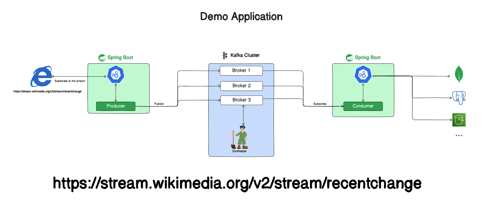