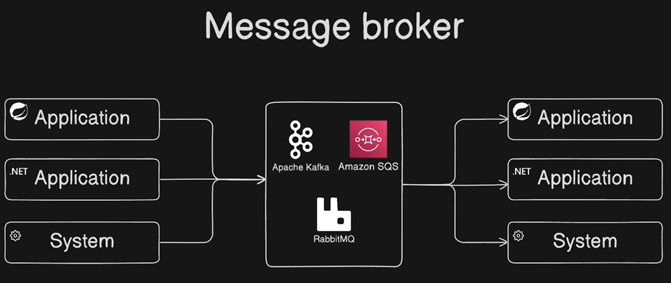
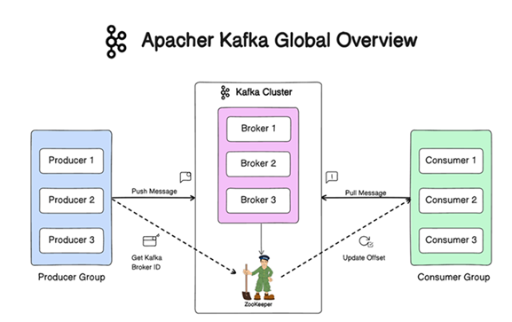
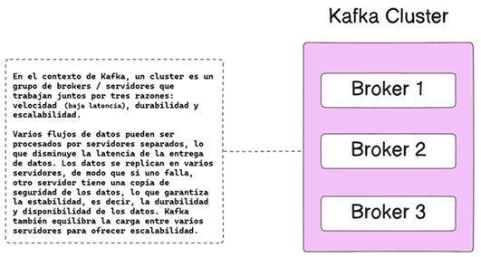

# [Apache Kafka Tutorial with Spring Boot Reactive & WebFlux | Kafka Tutorial](https://www.youtube.com/watch?v=KQDTtvZMS9c)

Tutorial tomado del canal de **youtube Bouali Ali**

---

## ¿Qué es un Message Broker?

Un `message broker` **(intermediario de mensajes o broker de mensajes)** es un componente de software intermediario
responsable de facilitar la comunicación y el intercambio de datos entre diferentes aplicaciones o sistemas, por lo que
su función principal es desacoplar a los `Producers`, que son las aplicaciones que envían datos al `broker`
(intermediario), de los `Consumers`, que son las aplicaciones que reciben los datos; por lo que el intermediario de
mensajes actúa como mediador asegurando que los mensajes se entreguen de manera eficiente y confiable desde
el `Producer` al `Consumer`.

La característica clave de los intermediarios de mensajes son, primero, tenemos el desacoplamiento, por lo tanto, el
intermediario de mensajes permite un acoplamiento flexible entre las aplicaciones al permitirles comunicarse sin la
necesidad de estar al tanto de la existencia de cada uno.

Como Message Broker tenemos a: `Apache Kafka, Amazon SQS o RabbitMQ`.

## Apache Kafka Global Overview

`Apache Kafka` es una plataforma de procesamiento de flujo e intermediario de mensajes distribuido, tolerante a fallas y
altamente escalable. `Apache Kafka` está diseñado para manejar grandes volúmenes de flujos de datos en tiempo real y de
manera tolerante a fallas.

## Kafka Cluster

Kafka es diseñado para operar como un sistema distribuido y un cluster le permite escalar horizontalmente, proporciona
tolerancia y maneja grandes volúmenes de datos a través de múltiples nodos.

En el contexto de `Kafka`, un cluster es un grupo de `brokers/servidores` que trabajan juntos por tres
razones: `velocidad (baja latencia)`, `durabilidad` y `escalabilidad`.

Varios flujos de datos pueden ser procesados por servidores separados, lo que disminuye la latencia de la entrega de
datos. Los datos se replican en varios servidores, de modo que si uno falla, otro servidor tiene la copia de seguridad
de los datos, lo que garantiza la estabilidad, es decir, la durabilidad y disponibilidad de los datos. Kafka también
equilibra la carga entre varios servidores para ofrecer escalabilidad.

## Kafka Broker

Los brokers de Kafka son servidores con tareas especiales: gestionar el equilibrio de carga, la replicación y el
desacoplamiento de flujos dentro del clúster de Kafka. Cómo hacen su trabajo? Bueno, en primer lugar, para iniciar un
clúster kafka, el desarrollador se autentica en un servidor boostrap (o unos cuantos). Estos son los primeros servidores
del clúster. Luego, los brokers también equilibran la carga y se encargan de la replicación, y esas dos características
son clave para la velocidad, escalabilidad y estabilidad de kafka.

Por lo que, un `Kafka Broker es un servidor Kafka individual` que almacena datos y atiende las solicitudes de los
clientes. Los `Brokers` dentro de un cluster se comunican entre sí para garantizar la replicación de datos y mantener
los metadatos del clúster y a cada broker en un clúster de kafka se le asigna un identificador único.

## Kafka Producer

El `Producer` es una aplicación cliente que publica o escribe eventos en un clúster de Kafka, por lo que el producer
puede ser una aplicación java, php, .net o cualquier otro tipo de aplicación, incluso una línea de comandos y
simplemente escribe o envía un evento a un clúster de Kafka.

## Kafka Consumer

El `consumer` es la aplicación o el sistema que consume o se suscribe al `topic` o al clúster de kafka para consumir los
eventos. Los consumidores pueden ser parte de un grupo de consumidores que les permite paralelizar el procesamiento de
mensajes.

## Kafka Topic

Un `kafka topic` es un canal lógico o una categoría de alimentación en la que **los productores publican registros
(mensajes) y los consumidores consumen registros.** Los `topics` sirven para organizar y categorizar el flujo de
mensajes dentro del sistema de mensajería kafka.

