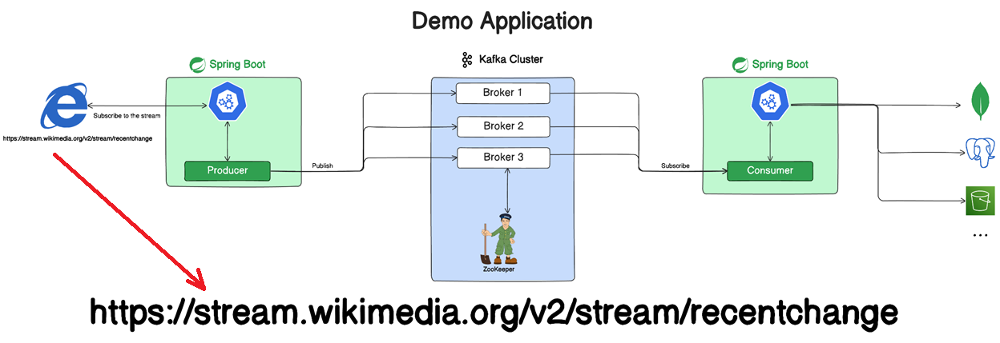

# Real World Application

---

A continuación se muestra de manera general la aplicación que crearemos. Por un lado, tenemos al `producer` que a partir
del flujo de datos obtenidos de la url `https://stream.wikimedia.org/v2/stream/recentchange` las enviará al cluster
de kafka; por el otro lado, tenemos a una aplicación `consumer` que estará escuchando los mensajes registrados en un
topic en específico. Finalmente, el `consumer` decidirá qué hacer con esos datos, algunas opciones sería el poder
almacenarlos en alguna base de datos.

